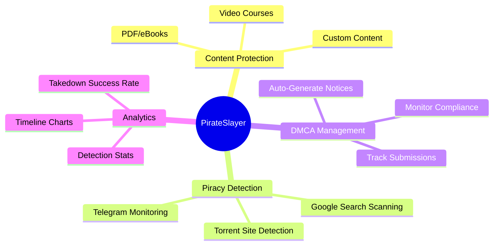
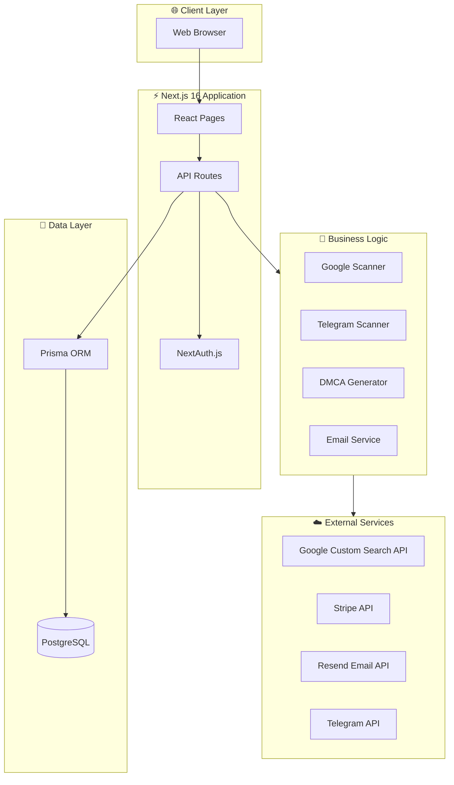
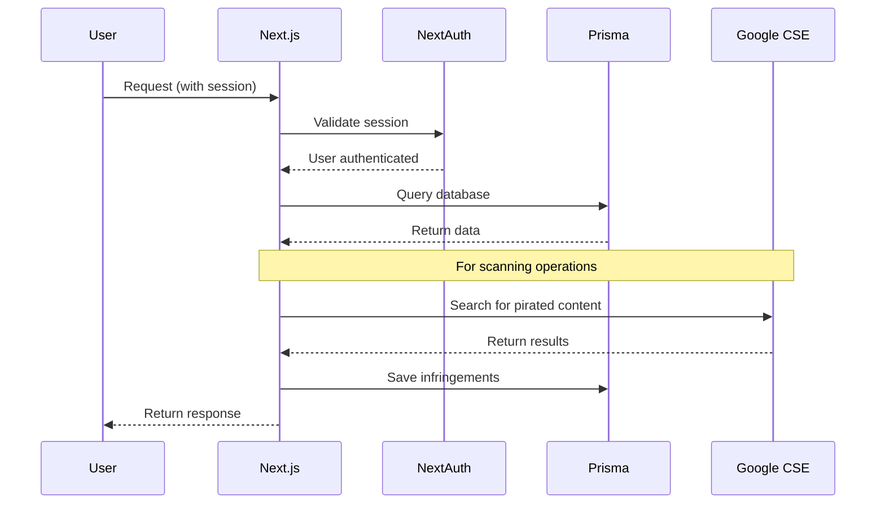
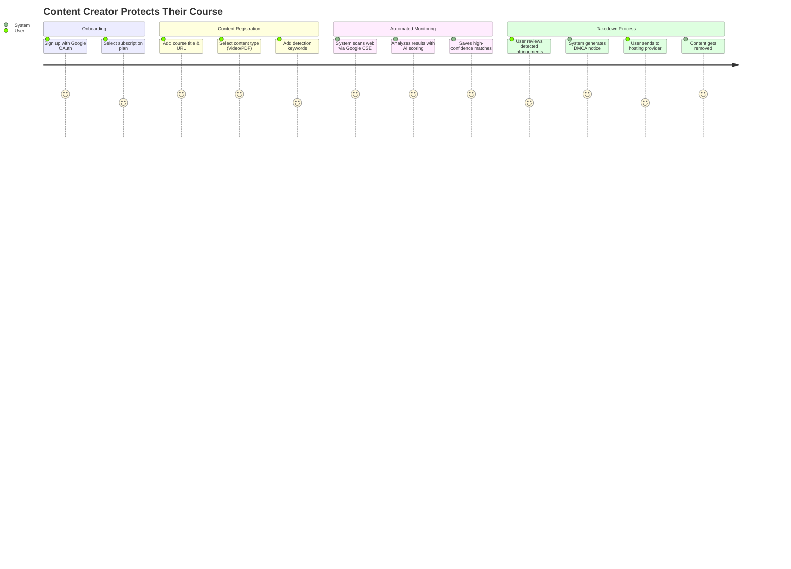
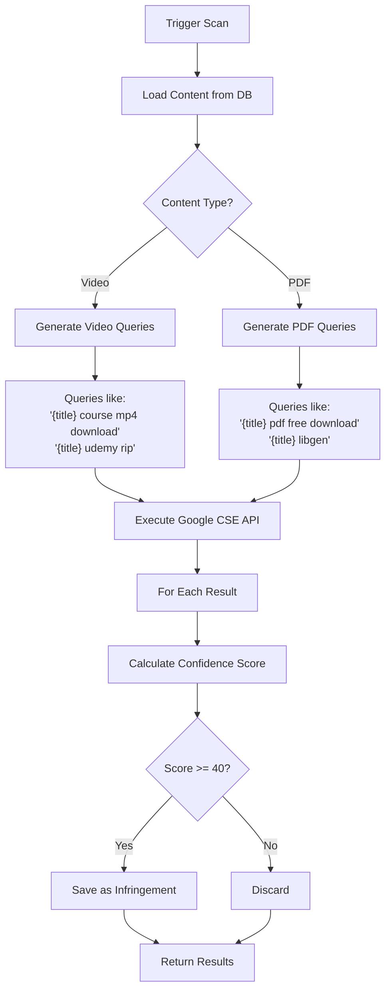
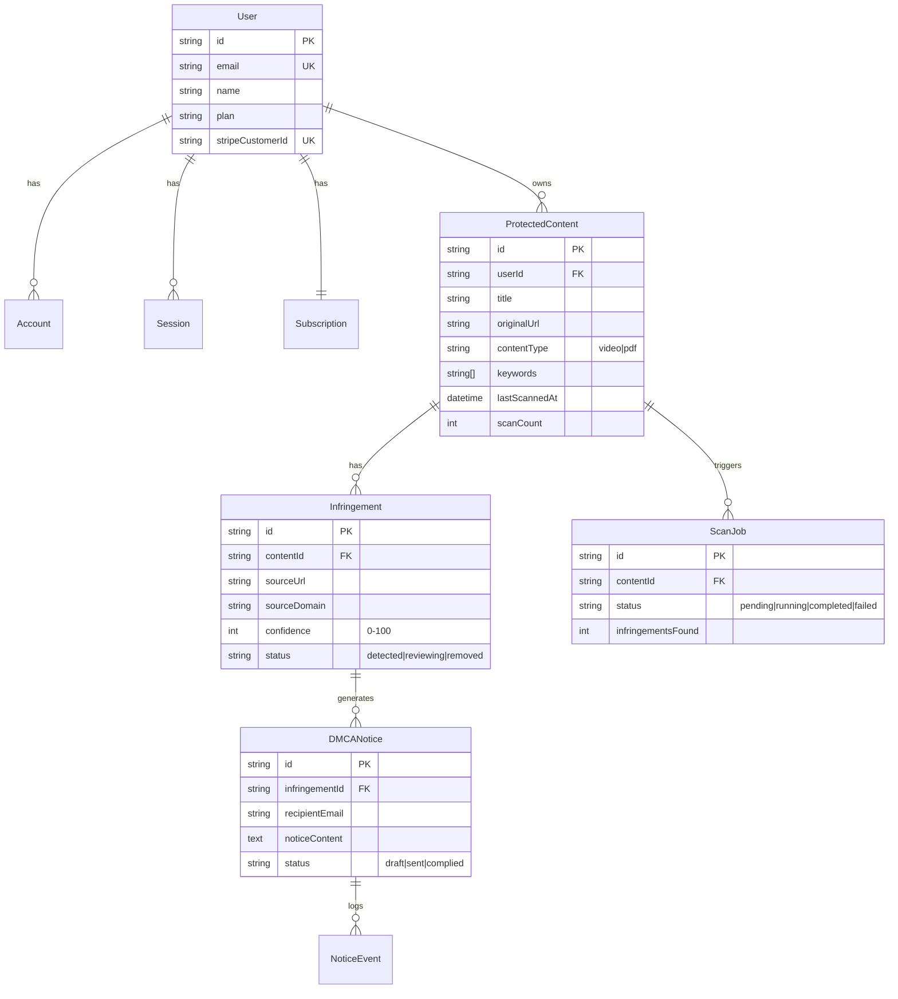

# PirateSlayer - Complete Product Documentation

> **DMCA Takedown-as-a-Service (SaaS)** platform for course creators and content publishers to protect their digital content from piracy.

---

## Table of Contents

1. [Overview](#overview)
2. [Features](#features)
3. [Architecture](#architecture)
4. [Repository Structure](#repository-structure)
5. [How It Works](#how-it-works)
6. [Database Schema](#database-schema)
7. [API Reference](#api-reference)
8. [External Dependencies](#external-dependencies)
9. [Getting Started](#getting-started)

---

## Overview

PirateSlayer is an automated content protection system that:
- **Monitors the web** for unauthorized copies of your content
- **Detects piracy** using intelligent scanning with confidence scoring
- **Generates DMCA notices** automatically with legal compliance
- **Tracks takedown status** from detection to removal

### Who Is This For?

| User Type | Use Case |
|-----------|----------|
| **Course Creators** | Protect video courses on Teachable, Thinkific, Gumroad |
| **eBook Authors** | Protect PDFs, EPUBs from sites like LibGen, Z-Library |
| **Content Publishers** | Monitor brand assets and digital materials |

---

## Features

### 🎯 Core Features



### Feature Breakdown

#### 1. Multi-Content Type Support
| Content Type | Supported Formats | Tracked Metadata |
|--------------|-------------------|------------------|
| **Video** | MP4, MKV, AVI, MOV | Duration, Resolution, File Size, Hash |
| **PDF/eBook** | PDF, EPUB, MOBI | Page Count, Author, File Size, Hash |

#### 2. Intelligent Piracy Detection
- **Content-Type Aware**: Different search patterns for videos vs PDFs
- **Known Piracy Domains**: Database of 50+ known piracy sites
- **Confidence Scoring**: 0-100 score based on multiple factors
- **Automatic Deduplication**: No duplicate infringements

#### 3. DMCA Notice Generation
- **Legally Compliant**: Follows 17 U.S.C. § 512(c) requirements
- **Auto-Fill Recipient**: Finds abuse emails for hosting providers
- **Multiple Formats**: Plain text and HTML versions
- **Event Tracking**: Full lifecycle from draft to removal

#### 4. Billing & Plans
| Plan | Protected Content | Scans/Month | Key Features | Price |
|------|-------------------|-------------|--------------|-------|
| Free | 1 | 10 | Basic scanning, Manual takedowns | $0 |
| Starter | 3 | 50 | Email reports, Basic analytics | $5/mo |
| Pro | 15 | 500 | Telegram monitoring, Torrent detection, Auto-takedowns | $15/mo |
| Enterprise | Unlimited | Unlimited | All features, API access, Dedicated support | $39/mo |

---

## Architecture

### High-Level System Architecture



### Request Flow



---

## Repository Structure

```
lifelong/
├── 📁 prisma/                    # Database schema & migrations
│   ├── schema.prisma             # Prisma schema definition
│   └── migrations/               # Database migration files
│
├── 📁 src/
│   ├── 📁 app/                   # Next.js App Router
│   │   ├── 📁 api/               # API Routes
│   │   │   ├── auth/             # NextAuth endpoints
│   │   │   ├── billing/          # Stripe checkout/portal
│   │   │   ├── content/          # Content CRUD + scanning
│   │   │   ├── cron/             # Scheduled scan jobs
│   │   │   ├── email/            # Email testing
│   │   │   └── webhooks/         # Stripe webhooks
│   │   │
│   │   ├── 📁 dashboard/         # Protected dashboard pages
│   │   │   ├── page.tsx          # Dashboard home
│   │   │   ├── content/          # Content management
│   │   │   ├── infringements/    # View detected piracy
│   │   │   ├── takedowns/        # DMCA notice tracking
│   │   │   ├── analytics/        # Charts & statistics
│   │   │   ├── billing/          # Subscription management
│   │   │   ├── settings/         # User settings
│   │   │   └── help/             # Help & documentation
│   │   │
│   │   ├── 📁 login/             # Authentication page
│   │   ├── page.tsx              # Landing page
│   │   ├── layout.tsx            # Root layout
│   │   └── globals.css           # Global styles
│   │
│   ├── 📁 components/            # React components
│   │   ├── 📁 dashboard/         # Dashboard-specific components
│   │   │   ├── header.tsx        # Top navigation bar
│   │   │   └── sidebar.tsx       # Side navigation
│   │   └── 📁 ui/                # Reusable UI components (shadcn/ui)
│   │
│   ├── 📁 lib/                   # Core libraries
│   │   ├── auth.ts               # NextAuth configuration
│   │   ├── db.ts                 # Prisma client singleton
│   │   ├── stripe.ts             # Stripe utilities & plan limits
│   │   └── utils.ts              # Helper functions (cn, etc.)
│   │
│   └── 📁 services/              # Business logic services
│       ├── 📁 scanners/          # Piracy detection
│       │   ├── google-scanner.ts # Google CSE scanning
│       │   └── telegram-scanner.ts
│       ├── 📁 dmca/              # DMCA management
│       │   └── notice-generator.ts
│       └── 📁 email/             # Email notifications
│           └── email-service.ts
│
├── 📁 dependencies/              # External service documentation
│   ├── postgresql.md
│   ├── stripe.md
│   ├── google-cse.md
│   ├── nextauth.md
│   ├── prisma.md
│   └── resend.md
│
├── 📁 scripts/                   # Utility scripts
├── package.json                  # Dependencies
├── DOCUMENTATION.md              # This file
├── SETUP_GUIDE.md               # Setup instructions
└── ENV_SETUP.md                 # Environment variables guide
```

### Key Files Explained

| File | Purpose |
|------|---------|
| `prisma/schema.prisma` | Defines all database models and relationships |
| `src/lib/auth.ts` | NextAuth.js configuration with Google OAuth |
| `src/lib/stripe.ts` | Stripe utilities, plan limits, checkout creation |
| `src/services/scanners/google-scanner.ts` | Core piracy detection logic |
| `src/services/dmca/notice-generator.ts` | DMCA notice generation |

---

## How It Works

### Complete User Journey



### Piracy Detection Algorithm



### Confidence Scoring Breakdown

| Factor | Points | Description |
|--------|--------|-------------|
| **Title Match (Full)** | +40 | Exact title found in result |
| **Title Match (Partial)** | +0-30 | Percentage of significant words matched |
| **Keyword Match** | +5 each | Each keyword found in title/snippet |
| **Free Download Keywords** | +10 | "torrent", "mega", "crack", etc. |
| **Known Piracy Domain** | +25 | General piracy sites (1337x, TPB) |
| **Content-Type Domain** | +20 | Video: YTS, RARBG / PDF: LibGen, Z-Lib |
| **File Extension in URL** | +15 | .mp4, .mkv, .pdf, .epub detected |

**Minimum threshold: 40 points** (results below this are discarded)

---

## Database Schema

### Entity Relationship Diagram



### Key Models

#### ProtectedContent
Stores user's protected content with type-specific metadata:
- **Video**: duration, resolution, file size, SHA-256 hash
- **PDF**: page count, author, file size, SHA-256 hash

#### Infringement
Tracks detected pirated copies:
- **Status Flow**: `detected` → `reviewing` → `takedown_sent` → `removed`
- **Confidence**: 0-100 score from detection algorithm

#### DMCANotice
Manages DMCA takedown notices:
- **Status Flow**: `draft` → `sent` → `acknowledged` → `complied`
- **Events**: Full audit trail via `NoticeEvent` model

---

## API Reference

### Authentication

All API routes (except webhooks) require authentication via NextAuth.js session.

### Content Management

| Endpoint | Method | Description |
|----------|--------|-------------|
| `/api/content` | GET | List all protected content |
| `/api/content` | POST | Add new protected content |
| `/api/content/[id]` | GET | Get content details |
| `/api/content/[id]` | DELETE | Remove protected content |
| `/api/content/[id]/scan` | POST | Trigger manual scan |

### Billing

| Endpoint | Method | Description |
|----------|--------|-------------|
| `/api/billing` | POST | Create Stripe checkout session |
| `/api/webhooks/stripe` | POST | Handle Stripe webhooks |

### Example: Add Protected Content

```typescript
POST /api/content
Content-Type: application/json

{
  "title": "Complete React Masterclass",
  "originalUrl": "https://teachable.com/my-course",
  "contentType": "video",
  "platformType": "teachable",
  "keywords": ["react", "hooks", "nextjs"]
}
```

---

## External Dependencies

This project relies on several external services. Detailed documentation for each is available in the `/dependencies` folder:

| Service | Purpose | Documentation |
|---------|---------|---------------|
| **PostgreSQL** | Primary database | [postgresql.md](./dependencies/postgresql.md) |
| **Stripe** | Billing & subscriptions | [stripe.md](./dependencies/stripe.md) |
| **Google Custom Search** | Piracy detection | [google-cse.md](./dependencies/google-cse.md) |
| **NextAuth.js** | Authentication | [nextauth.md](./dependencies/nextauth.md) |
| **Prisma** | Database ORM | [prisma.md](./dependencies/prisma.md) |
| **Resend** | Email notifications | [resend.md](./dependencies/resend.md) |

### Quick Reference: Environment Variables

```bash
# Database
DATABASE_URL="postgresql://..."

# Authentication
AUTH_SECRET="..."
AUTH_GOOGLE_ID="..."
AUTH_GOOGLE_SECRET="..."

# Stripe
STRIPE_SECRET_KEY="..."
STRIPE_WEBHOOK_SECRET="..."
NEXT_PUBLIC_STRIPE_PUBLISHABLE_KEY="..."

# Google Custom Search
GOOGLE_CSE_API_KEY="..."
GOOGLE_CSE_ID="..."

# Email
RESEND_API_KEY="..."
```

---

## Getting Started

### Prerequisites

- Node.js 20+
- PostgreSQL database
- Google Cloud account (for OAuth + CSE)
- Stripe account
- Resend account (optional, for emails)

### Quick Start

```bash
# 1. Clone the repository
git clone https://github.com/kirubaspace/lifelong.git
cd lifelong

# 2. Install dependencies
npm install

# 3. Set up environment variables
cp ENV_SETUP.md .env
# Edit .env with your credentials

# 4. Initialize database
npx prisma migrate dev

# 5. Run development server
npm run dev
```

### Detailed Setup

See [SETUP_GUIDE.md](./SETUP_GUIDE.md) for complete instructions including:
- Google OAuth configuration
- Stripe setup with webhooks
- Google Custom Search Engine creation
- Database provisioning

---

## Tech Stack Summary

| Category | Technology |
|----------|------------|
| **Framework** | Next.js 16 with App Router |
| **Language** | TypeScript |
| **Styling** | Tailwind CSS 4 |
| **Components** | shadcn/ui (Radix primitives) |
| **Database** | PostgreSQL + Prisma ORM |
| **Auth** | NextAuth.js v5 (Google OAuth) |
| **Payments** | Stripe |
| **Email** | Resend + Nodemailer |
| **Charts** | Recharts |
| **Forms** | React Hook Form + Zod validation |

---

*Last updated: January 2026*
